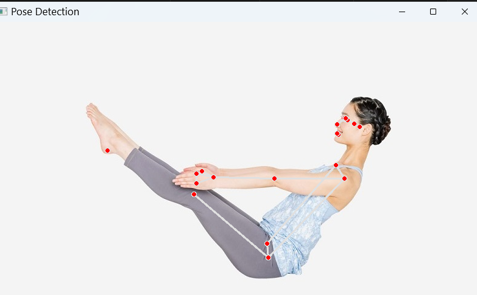

# MCAI(MotionCaputureAI)

※自作AIです。

- モーションキャプチャー（マーカーレス）AI
  - 画像や動画をinputして、指定のrigに位置情報をリターゲットして、Animation情報を出力

## 課題
  - FBX読み込み、吐出しの強化(blenderを参考に)
  - MotionCaptureの機械学習


## 目次

- [DevelopmentEnviroment](#developmentenviroment)
- [Directory](#Directory)
- [HowTo](#HowTo)


--------


# DevelopmentEnviroment

- conda 環境python3.11

```cpp
// nvidia-smiにてcuda versionを確認。GPUに合わせたpytorchをinstall
conda install pytorch torchvision torchaudio pytorch-cuda=12.4 -c pytorch -c nvidia

// 0.10.33はpipellineが不安定(solution Error)、0.10.14を明示的にinstall
pip install mediapipe==0.10.14

// リターゲットに必要なFBXを読み込む
pip install pyassimp

// assimp = 3Dモデル読み込みライブラリ,今のところ正常に動作しない。blender経由でのfbx読み込みを検討
conda install -c conda-forge assimp
```

---


# Directory

```

│
├── 📁 data/                    # 入力データ
│   ├── images/                 # 入力画像
│   ├── videos/                 # 入力動画
│   └── outputs/                # 出力結果
│       ├── landmarks/          # 3D頂点データ（JSON/CSV）
│       └── visualizations/     # 可視化画像・動画
│
├── 📁 models/                  # 学習済みモデルの重み
│   └── .gitkeep
│
├── 📁 src/
│   ├── detector.py       # MediaPipeで3D骨格取得
│   ├── converter.py      # 骨格データ → BVH変換
    ├── visualizer.py     # 確認用可視化
    └── exporter.py       # BVH/FBXファイル出力
    ├── normalizer.py     ← ：Mixamoスケールに正規化
    └── fbx_reader.py     ← ：MixamoFBXのボーン長さ読み込み
│
├── 📁 notebooks/               # Jupyter Notebook（実験・検証用）
│   └── 01_prototype.ipynb
│
├── 📁 tests/                   # テストコード
│   └── test_detector.py
│
├── 📁 config/                  # 設定ファイル
│   └── settings.yaml           # パラメータ設定
│
├── main.py                     # エントリーポイント
├── requirements.txt            # pip用ライブラリリスト
├── environment.yml             # conda環境ファイル
└── README.md                   # プロジェクト説明
```

------


# HowTo

- 作成途中


- MotionCuptureImage


- MotionCaptureMovie
